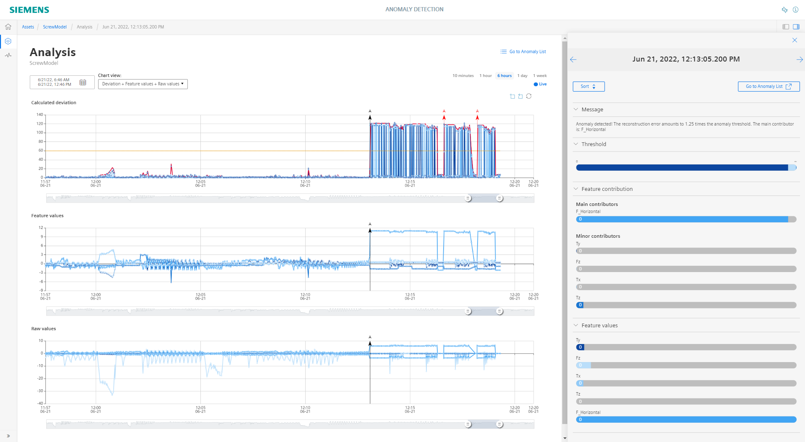

# Anomayl Detection getting started tutorial 

This example shows how to use the Industrial Edge app "Anomaly Detection" to analyze your automation process. During this tutorial you will go through every single setup step to train a machine learning model on time series input data.

- [Anomaly Detection getting started tutorial](#anomaly-detection-getting-started)
  - [Description](#description)
    - [Overview](#overview)
    - [General task](#general-task)
  - [Requirements](#requirements)
    - [Prerequisites](#prerequisites)
    - [Used components](#used-components)
  - [Configuration steps](#configuration-steps)
  - [Documentation](#documentation)
  - [Contribution](#contribution)
  - [Licence and Legal Information](#licence-and-legal-information)

## Description

### Overview

This document describes how to create an Anomaly Detection model. This model is used to detect unnormal behavior in time series data. If an unnormal behavior is detected the app can be used to get a first impression what caused the problem and where to start the further investigation.   
  

### General Task

- You will see how to select the data and transform it for the machine learning model training. 
- After that you will see how to define the model parameters and start the training. 
- In the last step you will start the live detection.

## Requirements

### Prerequisites
- Access to Industrial Edge Management System (IEM)
- Onboarded Industrial Edge Device (IED) on IEM  

### Used components

* Industrial Edge Device V 1.5.x
* IE Databus V1.6.6
* IE Data Service V 1.3.3
* IE Flow Creator V 1.3.8
* Anomaly Detection V1.0.0

## Configuration steps

* [Build the Data simulation application](docs/Installation_ScrewSimulation.md)
* [Setup the Anomaly Detection](docs/Installation.md)

## Documentation

You can find further documentation and help in the following links

* [Industrial Edge Hub](https://iehub.eu1.edge.siemens.cloud/#/documentation)
* [Industrial Edge Forum](https://www.siemens.com/industrial-edge-forum)
* [Industrial Edge landing page](https://new.siemens.com/global/en/products/automation/topic-areas/industrial-edge/simatic-edge.html)
* [Industrial Edge GitHub page](https://github.com/industrial-edge)

## Contribution

Thank you for your interest in contributing. Anybody is free to report bugs, unclear documentation, and other problems regarding this repository in the Issues section.
Additionally everybody is free to propose any changes to this repository using Pull Requests.

If you are interested in contributing via Pull Request, please check the [Contribution License Agreement](Siemens_CLA_1.1.pdf) and forward a signed copy to [industrialedge.industry@siemens.com](mailto:industrialedge.industry@siemens.com?subject=CLA%20Agreement%20Industrial-Edge).

## License and Legal Information

Please read the [Legal information](LICENSE.txt).

