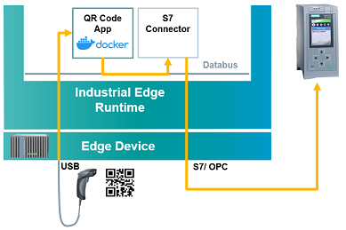

# Anomayl Detection getting started tutorial 

This example shows how to use the Industrial Edge app "Anomaly Detection" to analyze multiple time series data.

- [Anomaly Detection getting started tutorial](#anomaly-detection-getting-started)
  - [Description](#description)
    - [Overview](#overview)
    - [General task](#general-task)
  - [Requirements](#requirements)
    - [Prerequisites](#prerequisites)
    - [Used components](#used-components)
  - [Installation](#installation)
  - [Usage](#usage)
  - [Documentation](#documentation)
  - [Contribution](#contribution)
  - [Licence and Legal Information](#licence-and-legal-information)

## Description

### Overview

This tutorial should lead you through the setup process of the Anomaly Detection App.  

### General Task

- You will see how to select the data and transform it for the machine learning model training. 
- After that you will see how to acutally define the the model parameters and start the training. 
- In the last step you will start the live detection.

## Requirements

### Prerequisites

What are the requirements on the user knowledge, HW components before starting the how-to?

### Used components

List the used software and hardware components that were tested with this how-to.
Add the used components here (e.g.)

* Industrial Edge App Publisher V1.0.8
* Docker Engine 18.09.6
* Docker Compose V2.4
* S7 Connector V 1.0.22
* S7 Connector Configurator V 1.0.9
* Industrial Edge Device V 1.0.0-34
* TIA Portal V16
* PLC: CPU 1511 FW 2.8.3

## Installation

How to install/run this application example? (i.e. how to deploy it to Industrial Edge device?) How to build this application? How to set up configurations in IE?

To keep the readme.md file as short as possible please add more detailed information in the docs folder.

* [Build application](docs/Installation.md#build-application)

## Usage

When the app is installed, how can I use it? Usually some basic UI description to prove that the app is working correctly.

## Documentation

Add links to documentation. Either on external URL or in the doc folder. Please use always link to a file not to a directory (it doesn't work with static site generator engines).

Add these links:

You can find further documentation and help in the following links

* [Industrial Edge Hub](https://iehub.eu1.edge.siemens.cloud/#/documentation)
* [Industrial Edge Forum](https://www.siemens.com/industrial-edge-forum)
* [Industrial Edge landing page](https://new.siemens.com/global/en/products/automation/topic-areas/industrial-edge/simatic-edge.html)
* [Industrial Edge GitHub page](https://github.com/industrial-edge)

## Contribution

Thank you for your interest in contributing. Anybody is free to report bugs, unclear documentation, and other problems regarding this repository in the Issues section.
Additionally everybody is free to propose any changes to this repository using Pull Requests.

If you are interested in contributing via Pull Request, please check the [Contribution License Agreement](Siemens_CLA_1.1.pdf) and forward a signed copy to [industrialedge.industry@siemens.com](mailto:industrialedge.industry@siemens.com?subject=CLA%20Agreement%20Industrial-Edge).

## License and Legal Information

Please read the [Legal information](LICENSE.txt).

