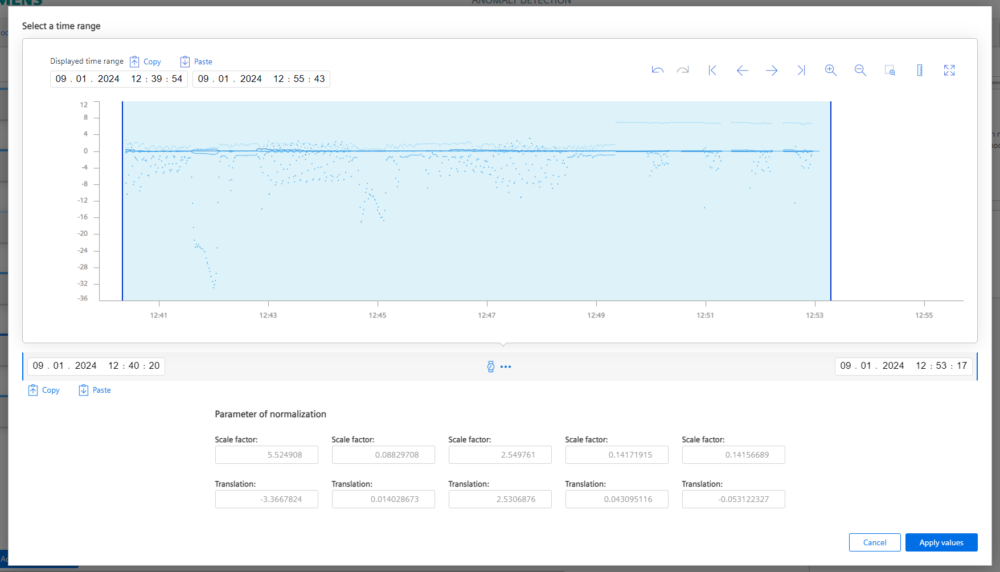
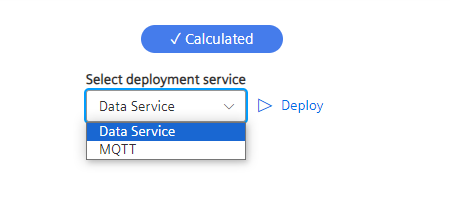

# Setup Anomaly Detection

- [Setup Anomaly Detection](#setup-anomaly-detection)
  - [Start application](#start-application)
    - [Create new model](#create-new-model)
    - [Select data](#select-data)
    - [Transform and normalize data](#transform-and-normalize-data)
    - [Define algorithm and perform model creation](#define-algorithm-and-perform-model-creation)
    - [Set threshold and deploy model for Live Anomaly Detection](#set-threshold-and-deploy-model-for-live-anomaly-detection)
  - [View Live Anomaly Detection model inference](#view-live-anomaly-detection-model-inference)
  

  
## Start application

- Open the Anomaly Detection App on or IED

<kbd></kbd>

### Create new model 

- To create a new model, go to the 'Model generation' section add a new model and give a specific name.

<kbd></kbd>

### Select data

- Select relevant input data for the Anomaly Detection’s AI
- Click on the 'Add variable' button and unhide the Asset structure on the left side. 
- Then select all variables you want to use for model creation (in case you are using the Screw Simulation select all six tags)
- Next step is to define a sample rate for your input data

<kbd></kbd>

- After you have selected the variables click on the 'Edit' icon in the 'Time range for model generation' section
- On the top of the window you can enter a time range for displaying the data
- The time range for the model creation will then be defined in the section at the bottom of the window (red marked)
- This time range is then marked with the blue section in the data window 

<kbd></kbd>

### Transform and normalize data
- Before we feed the force values of your screwing simulation into the network we want to perform a data transformation 
- The Forces Fx and Fy in x and y direction are representing the horizontal force values, in this case we are not interested weather the force is peformed in negativ or positiv direction so we need the absolute value 
- Therefore click on the 'Data Transformation' section
- By clicking on the connection between to nodes 'Fx' and 'Normalization' additional transformation nodes can be added, in this case select “abs”
- Redo this step for the connection between the node 'Fy' and 'Normalization'

<kbd></kbd>

<kbd></kbd>

- Before we feed the transformed data into our model creationthe values should be normalized. 
- Select all normalization blocks by clicking on 'Normalization' (red marked)
- By clicking on 'Derive from time series data...' (green marked) the scaling and translation factor for each signal is automatically calculated

<kbd></kbd>

- Now apply the values

### Define algorithm and perform model creation

- Change to the 'Algorithm' section
- Select Full Relationship Analysis (if you use an IPC127 or IPC 227 this algorithm is already selected and cannot be changed)
- Set the Epochs to 20, which means that the defined time range we previously defined is used 20 times in order to come up with a better model for each epoch. The so called training losses can then be observed for each epoch
- We will also use a smoothing algorithm: Define a 0.2 Exponential smoothing of the calculated deviation curve which represents the anomaly score
- Because we will select the threshold for detected anomalies after the model creation we select here the 'Only manually' method

<kbd></kbd>

- Now you can switch to the 'Model calculation' section and start the model creation. 

<kbd></kbd>

- The model creation may take a while (in this example about 10 - 20 minutes depending on the selected time range and epochs) so feel free to grab a coffee ;-)

### Set threshold and deploy model for Live Anomaly Detection

- The model creation is now completed 
- The lower your training loss is at the last epoch the better your training performed as you can see in the chart in top right corner 

<kbd></kbd>

- To only get the calculated deviation displayed you can hide the feature signal in the 'Features' section (red marked) by clicking on the 'eye' icons

<kbd></kbd>

- Now you set the threshold for the calculated anomaly score in that way that it is between 'normal' screwing process and the screwing processes where some abnormal behavior occurred 

- When the threshold is set, you can finally go to the 'Deploy' section and deploy your just created model in order to execute the Live Anomaly Detection on your live data

<kbd></kbd>

## View Live Anomaly Detection model inference

- In the Assets section you have an overview of all currently running Anomaly Detection models

<kbd></kbd>

- If an anomaly is detected you can go to the analysis view in the menu on the right side to get a detailed view

<kbd></kbd>

- Every time the calculated deviation exceeds the threshold an anomaly is indicated
- Tge main contributors for a specific anomaly can be indicated by clicking on the anomaly marker (red marked)
