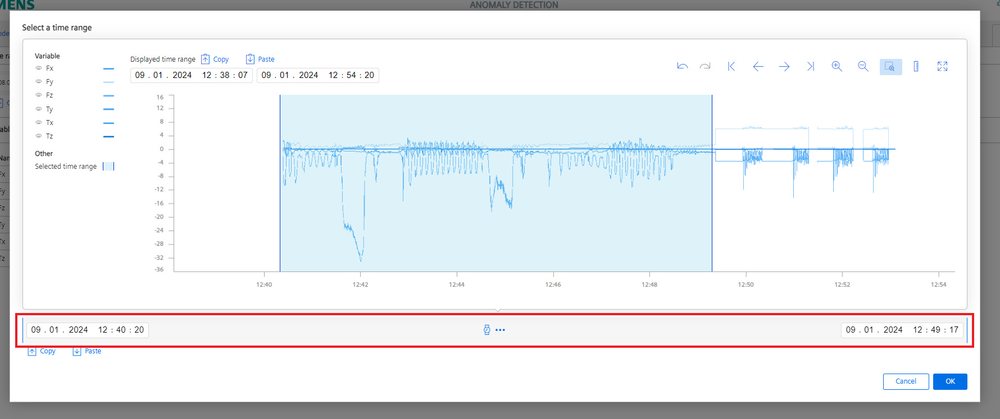

# Installation

- [Installation](#installation)
  - [Build application](#build-application)
    - [Create new model](#create-new-model)
    - [Select data](#select-data)
    - [Transform and normalize data](#transform-and-nomalize-data)
    - [Define algorithm and perform training](#define-algorithm-and-perform-training)
    - [Set threshold and deploy model](#set-threshold-and-deploy-model)
  - [View live models](#view-live-models)
    - [Asset view](#asset-view)
    - [Anomaly view](#anomaly-view)

  
## Build application

<kbd></kbd>

### Create new model 

- To create a new model go to the 'Model generation' section add a new model and give a specific name.

<kbd></kbd>

### Select data

- Next step is to define a sample rate for your training data
- Click on the 'Add variable' button and unhide the Asset structure on the left side. 
- Then select all variables you want to use for your training (in case you are using the ScrewSimulation select all six values)

<kbd></kbd>

- After you have selected the variables click on the 'Edit' icon in the 'Time range for model generation' section
- On the top of the window you can enter a time range for displaying the data
- The time range for the model training is then defined in the section at the bottom of the window (red marked)
- This time range is then marked with the blue section in the data window 

<kbd></kbd>

### Transform and normalize data
- After the raw input data for the model training is defined, data transformation and normalization can be performed 
- By clicking on the connection between to nodes additional transformation nodes can be added. 

<kbd></kbd>

- In the screwing process we feed our model with force and torque vales in x,y and z direction. 
- The x,y direction are representing the horizontal force values and therefore we are not intesent weather the force is performed in negativ or positiv direction, so we want the absolute values for our network training

<kbd></kbd>

- Before we feed the transformed data into our model training the values have to be normalized. 
- Select all normalization blocks by clicking on 'Normalization' (red marked)
- By clicking on 'Derive from time series data...' (green marked) the scaling and translation factor for each signal is automatically calculated

<kbd></kbd>

### Define algorithm and perform training

### Set threshold and deploy model

## View live models

### Asset view

### Anomaly view

