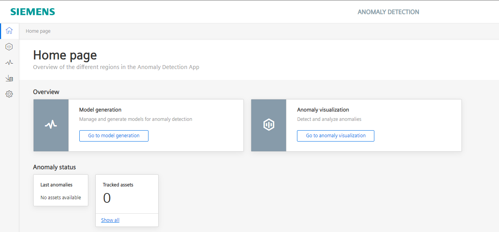
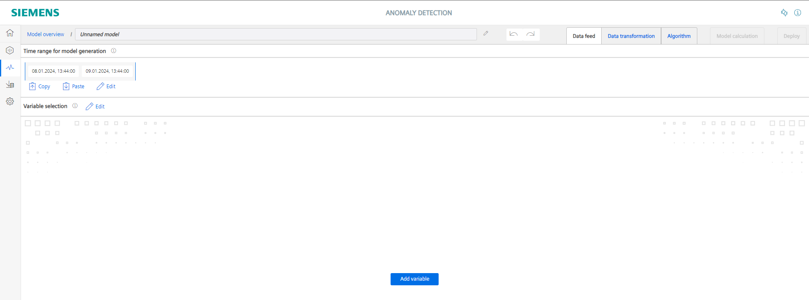
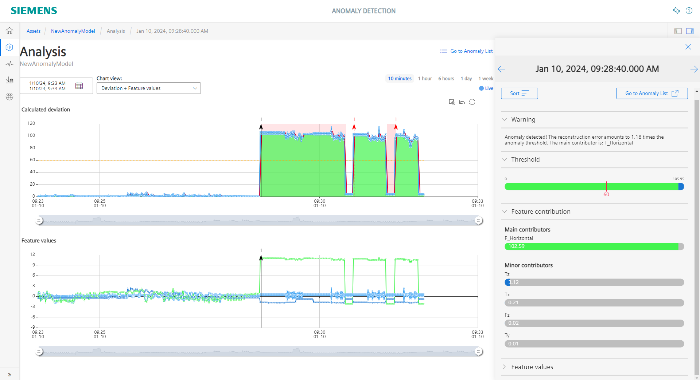

# Installation

- [Installation](#installation)
  - [Build application](#build-application)
    - [Create new model](#create-new-model)
    - [Select data](#select-data)
    - [Transform and normalize data](#transform-and-normalize-data)
    - [Define algorithm and perform training](#define-algorithm-and-perform-training)
    - [Set threshold and deploy model](#set-threshold-and-deploy-model)
  - [View live models](#view-live-models)
  

  
## Build application

<kbd></kbd>

### Create new model 

- To create a new model go to the 'Model generation' section add a new model and give a specific name.

<kbd></kbd>

### Select data

- Next step is to define a sample rate for your training data
- Click on the 'Add variable' button and unhide the Asset structure on the left side. 
- Then select all variables you want to use for your training (in case you are using the ScrewSimulation select all six values)

<kbd></kbd>

- After you have selected the variables click on the 'Edit' icon in the 'Time range for model generation' section
- On the top of the window you can enter a time range for displaying the data
- The time range for the model training is then defined in the section at the bottom of the window (red marked)
- This time range is then marked with the blue section in the data window 

<kbd></kbd>

### Transform and normalize data
- After the raw input data for the model training is defined, data transformation and normalization can be performed 
- By clicking on the connection between to nodes additional transformation nodes can be added. 

<kbd></kbd>

- In the screwing process we feed our model with force and torque vales in x,y and z direction. 
- The x,y direction are representing the horizontal force values and therefore we are not intesent weather the force is performed in negativ or positiv direction, so we want the absolute values for our network training

<kbd></kbd>

- Before we feed the transformed data into our model training the values have to be normalized. 
- Select all normalization blocks by clicking on 'Normalization' (red marked)
- By clicking on 'Derive from time series data...' (green marked) the scaling and translation factor for each signal is automatically calculated

<kbd></kbd>

### Define algorithm and perform training

- Change to the 'Alorithm' section
- Select Full Relationship Analysis
- Set the Epochs to 20, which means that the defined time range we previously defined is used 20 times for the model training
- Define a 0.2 Expontial smoothing of the calculated deviation curve
- Because we select the threshold for detected anomalies after the training we select the 'Only manually' method

<kbd></kbd>

- Now you can swtich to the 'Model calculation' section and start the model training. 

<kbd></kbd>

- The model training may take a while (about 10 - 20 minutes depending on the selected time range and epochs) so feel free to grab a coffee ;-)

### Set threshold and deploy model

- The training is now completed 
- The lower your training loss is at the last epoch the better your training performed as you can see in the chart in top right corner 

<kbd></kbd>

- To only get the calculated deviation displayed you can hide the feature signal in the 'Features' section (red marked) by clicking on the 'eye' icons

<kbd></kbd>

- Now you set the threshold between 'normal' screwing process and the screwing processes where some unnormal behaviour occoured 

- When the threshold is set you can finally go to the 'Deploy' section and deploy your trained model

<kbd></kbd>

## View live models

- In the Assets section you have overview of all currently running Anomaly Detection models

<kbd></kbd>

- If an anomaly is detected you can go to the analysis view in the menu on the right side

<kbd></kbd>

- Every time the calculated deviation is higher than the threshold a anomaly is detected
- The get the main contributors of the anomaly you have to click on the anomaly marker (red marked)
