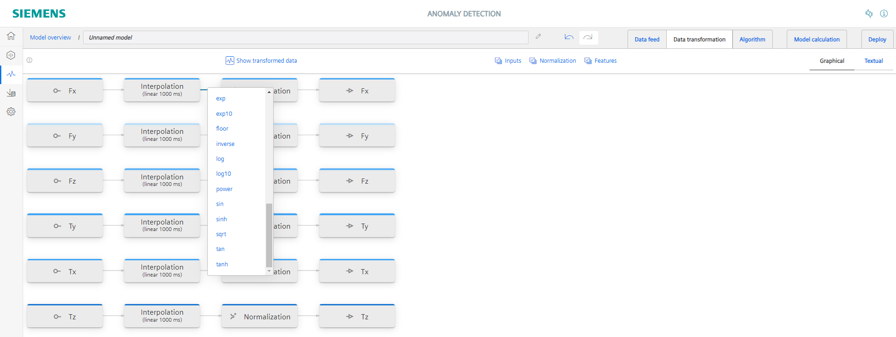
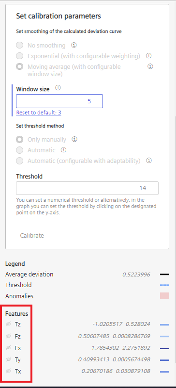

# Setup Anomaly Detection

- [Setup Anomaly Detection](#setup-anomaly-detection)
  - [Start application](#start-application)
    - [Create new model](#create-new-model)
    - [Select data](#select-data)
    - [Transform and normalize data](#transform-and-normalize-data)
    - [Define algorithm and perform model creation](#define-algorithm-and-perform-model-creation)
    - [Set threshold and deploy model for Live Anomaly Detection](#set-threshold-and-deploy-model-for-live-anomaly-detection)
  - [View Live Anomaly Detection model inference](#view-live-anomaly-detection-model-inference)
  

  
## Start application

- Open the Anomaly Detection App on your IED

<kbd></kbd>

### Create new model 

- To create a new model, go to the 'Model generation' section add a new model.

<kbd></kbd>

### Select data

- Select relevant input data for the creation of the Anomaly Detection algorithm. 
- Click on the 'Add variable' button.
- Then select all variables you want to use for model creation (in case you are using the Screw Simulation select all six tags - Fx,Fy,Fz,Tx,Ty,Tz)

<kbd></kbd>

- After you have selected the variables click on the 'Edit' icon in the 'Time range for model generation' section
- On the top of the window you can enter a time range for displaying the data
- The time range for the model creation will then be defined in the section at the bottom of the window (red marked)
- This time range is used for the model creation to learn the relations of the input variables and therefore should not contain anomalies
  

<kbd></kbd>

### Transform and normalize data
- Before we feed the force values of your screwing simulation into the network we want to perform a data transformation 
- The Forces Fx and Fy are representing the horizontal force values in x and y direction, however we are only interested in the resulting horizontal force and therefore have to a little vector addition
- To do this click on the 'Data Transformation' section
- By clicking on the connection between the nodes 'Fx' and 'Normalization' additional transformation nodes can be added.

<kbd></kbd>

- Add the same transformation nodes to your flow chart as you see it in the picture below.

<kbd></kbd>

- At the and you can also change the name and the color of the output variables.

<kbd></kbd>

- Before we feed the transformed data into our model creation the values should be normalized. 
- Select all normalization blocks by clicking on 'Normalization' (red marked)
- By clicking on 'Derive from time series data...' (green marked) the scaling and translation factor for each signal is automatically calculated
- 

<kbd></kbd>

<kbd></kbd>

- Now apply the values

### Define algorithm and perform model creation

- Change to the 'Algorithm' section
- Select Full Relationship Analysis (if you use an IPC 127 or IPC 227 this algorithm is already selected and cannot be changed)
- Set the batch size down to 4, which means that during the model training 4 time frames are sent through the network simultaneously.
- Set the Epochs to 8, which means that the defined time range we previously defined is used 8 times in order to come up with a better model for each epoch. The so called training losses can then be observed for each epoch.

<kbd></kbd>

- Now you can switch to the 'Model calculation' section and start the model creation. 

<kbd></kbd>

- The model creation may take a while (depending on the selected time range and epochs) so feel free to grab a coffee in the meanwhile ;-)

### Set threshold and deploy model for Live Anomaly Detection

- The model creation is now completed 
- The lower your training loss is at the last epoch the better your training performed as you can see in the chart in top right corner 
- In main window you can see the calculated deviations for each tag. A high deviation means that the difference between predicted value und actual value is high. 
  

<kbd></kbd>

- As the anomaly detection is an unsupervised learning we have to determine at which threshold an anomaly should be marked.  
- To only get the average calculated deviation displayed you can hide the feature signals in the 'Features' section by clicking on the 'eye' icons

<kbd></kbd>

- To filter out outliers and smoothen the deviation function and Moving average with Windowsize 5 should be defined

- Now you set the threshold for the calculated anomaly score in that way that it is between 'normal' screwing process and the screwing processes where some abnormal behavior occurred
  

<kbd></kbd>

- When the threshold is set, you can finally go to the 'Deploy' section and deploy your just created model in order to execute the Live Anomaly Detection on your live data
- Here you can also define if the data for the live anomaly detection is taken directly from the Databus or over the IIH Essentials database.

<kbd></kbd>

## View Live Anomaly Detection model inference

- In the Assets section you have an overview of all currently running Anomaly Detection models

<kbd></kbd>

- If an anomaly is detected you can go to the analysis view in the menu on the right side to get a detailed view

<kbd></kbd>

- Every time the calculated deviation exceeds the threshold an anomaly is indicated
- The main contributors for a specific anomaly can be indicated by clicking on the anomaly marker.
