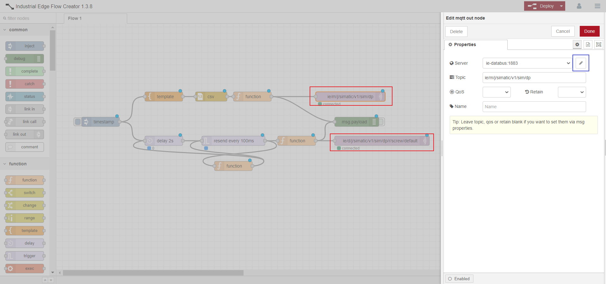

# Installation of screwing simulation

This installation guide shows how to Configure IE Databus, IE Data Service and the IE Flow Creator run a simulation which is then used to train our Anomaly Detection algorithm. 

- [Installation of screwing simulation](#Installation_ScrewSimulation)
  - [Used Components](#used-components)
  - [Configure IE Databus](#configure-ie-databus)
  - [Configure DataService Adapter](#Configure-DataService-Adapter)
  - [Configure IE Flow Creator](#configure-ie-flow-creator)
    - [Import Flow](#import-flow)
    - [Edit Databus Credentials](#edit-databus-credentials)
  - [Start Simulation and add variables to IE Data Service](#start-simulation-and-add-variables-to-ie-data-sservice)

## Used Components

To run the simulation the following components are needed:
- IE Databus V1.6.6
- IE Flow Creator V1.3.8
- IE Data Service V1.3.3
 
## Configure IE Databus

First of all, make sure that you have created a databus user which has subscription rights with the topic 'ie/#'.

<kbd></kbd>

## Configure Data Service Adapter

- Open the IE Data Service app and go to the adapter Section. 

- There you have to add an new adapter with:
  - Adapter name (you are free to choose your own name) 
  - Broker URL: tcp://ie-databus:1883
  - Your own databus credentials
  - Metadata topic ie/m/j/simatic/v1/sim/dp

<kbd></kbd>

- After that activate the Adapter

<kbd></kbd>

## Configure IE Flow Creator

- After we created the Data Service adatper we are now going to configure the actual simulation, which is publishing data onto the databus. 

### Import Flow

- First open the IE Flow Creator application and open the 'burger menu' in the top right corner. 

- Select 'Import' or you use the shortcut 'ctrl-i'.

<kbd></kbd>

- Import the JSON file which can be downloaded [in the src folder](../src).

### Edit Databus Credentials

- After the flow import you have to adapt the databus credentials in the MQTT-Out nodes (red marked).

- Therefore double click on one of them and select the pen icon next to the 'Server' section (blue marked).

<kbd></kbd>

- Go to the Security section and enter your databus credentials again.

<kbd></kbd>

 - Now you can click on 'Update' and 'Deploy' the flow. 

## Start Simulation and add variables to IE Data Service

- By clicking on the timestamp node (green marked) the simulation is started.
- First the metadata is sent and afterwards recorded values in the included CSV-File are going to be published on the databus every 100ms. 

<kbd></kbd>

- Now Go back to the IE Data Service app and create a new ‘Child Asset’ in the three point menu (red marked).
- On the right side you have the option to add multiple variables to your asset (green marked)
- Now Select the previously defined adapter (blue marked)
- Add all six variables by selecting the checkboxes and save the configuration

<kbd></kbd>

