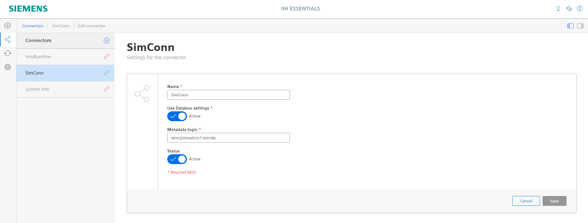

# Installation of screwing simulation

This installation guide shows how to Configure IE Databus, IE Data Service and the IE Flow Creator run a simulation which is then used to train our Anomaly Detection algorithm. 

## Used Components

To run the simulation the folloing components are needed:
- IE Databus V1.6.6
- IE FlowCreator V1.3.8
- IE DataService V1.3.3

- [Installation of screwing simulation](#Installation_ScrewSimulation)
  - [Used Components](#used-components)
  - [Configure IE Databus](#configure-ie-databus)
  - [Configure DataService Adapter](#Configure-DataService-Adapter)
  - [Configure IE Flow Creator](#configure-ie-flow-creator)
    - [Import Flow](#import-flow)
    - [Edit Databus Credentials](#edit-databus-credentials)
  - [Start Simulation and add variables to IE Data Service](#start-simulation-and-add-variables-to-ie-data-sservice)
 
## Configure IE Databus

First of all make sure that you have created a databus user which has subscription rights with the topic 'ie/#'.

<kbd></kbd>

## Configure Data Service Adapter

- Open the IE Data Service app and go to the adapter Section. 

- There you have to add an new Adapter with:
  - Adapter name (you are free to choose your own name) 
  - Broker URL: tcp://ie-databus:1883
  - Your own databus credentials
  - Metadata topic ie/m/j/simatic/v1/sim/dp

<kbd></kbd>

- Open console in the source code folder
- Use command `docker-compose build` to create the docker image.
- This docker image can now be used to build you app with the Industrial Edge App Publisher
- *docker images | grep scannerapp* can be used to check for the images
- You should get a result similiar to this:

## Configure IE Flow Creator

### Import Flow

### Edit Databus Credentials

## Start Simulation and add variables to IE Data Service

