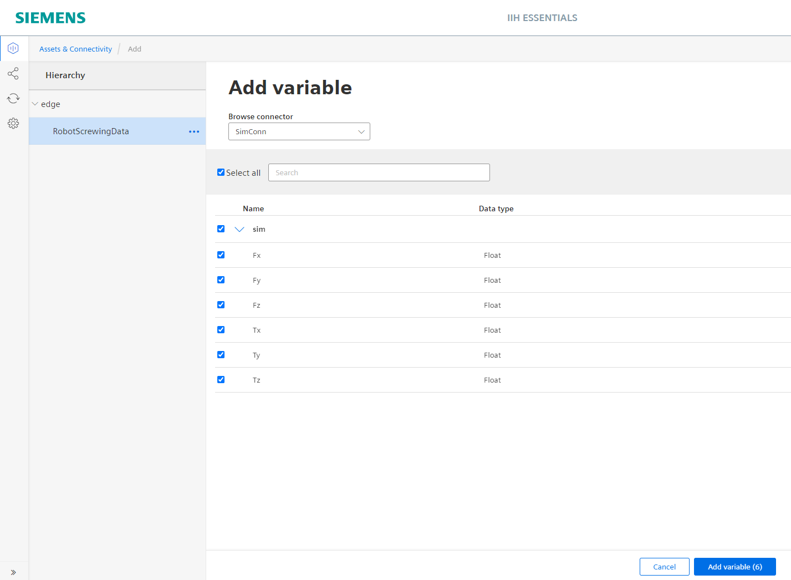

# Installation of screwing simulation

This installation guide shows how to Configure the Databus, the IIH Essentials and the Flow Creator to run a simulation which is then used for the Anomaly Detection algorithm 

  - [Used Components](#used-components)
  - [Configure Databus](#configure-databus)
  - [Configure Flow Creator](#configure-flow-creator)
    - [Import Flow](#import-flow)
    - [Edit Databus Credentials](#edit-databus-credentials)
    - [Start the Simulation](#start-the-simulation)
  - [Configure IIH Essentials](#configure-iih-essentials)
    - [Add new Connector](#add-new-connector)
    - [Add variables to IIH Essentials](#add-variables-to-iih-essentials)
  

## Used Components

To run the simulation the following components are needed:
- Databus V 2.3.1-2
- Flow Creator V 1.16.0
- IIH Essentials V 1.9.0
 
## Configure Databus

First of all, make sure that you have created a databus user which has subscription rights with the topic 'ie/#'.

<p align="left"><kbd></kbd></p>

## Configure Flow Creator

### Import Flow

- First open the IE Flow Creator application and open the 'three bar menu' in the top right corner. 

- Select 'Import' or you use the shortcut 'ctrl-i'.
  
- Import the JSON file which can be downloaded [here](../src).
  
<p align="left"><kbd></kbd></p>


### Edit Databus Credentials

- After the flow import you have to adapt the databus credentials in the MQTT-Out nodes (red marked).

- Therefore double click on one of them and select the pen icon next to the 'Server' section (blue marked).

<p align="left"><kbd></kbd></p>

- Go to the Security section and enter your databus credentials again.

<p align="left"><kbd></kbd></p>

 - Now you can click on 'Update' and 'Deploy' the flow. 

### Start the Simulation

- By clicking on the timestamp node (green marked) the simulation is started.
- First the metadata is sent and afterwards recorded values in the included CSV-File are going to be published on the databus every 100ms. 

<p align="left"><kbd></kbd></p>

## Configure IIH Essentials

### Add new connector

- If you haven't set the Databus Settings in the IIH Essentials yet, go to the Settings Section of the IIH Essentials app and configure the default Databus Settings.
    
  <p align="center"><kbd></kbd></p>
  
- Now go to the connector Section.

- There you have to add a new connector:
  - Adapter name (you are free to choose a custom name)
  - Set the "Use Databus settings" checkbox to use the predefined Databus Settings from the IIH Essentials app
  - Metadata topic:
    ```
    ie/m/j/simatic/v1/sim/dp
    ```
  - Set the "Status" checkbox to activate the adapter
    
<p align="center"><kbd></kbd></p>

### Add variables to IIH Essentials

- Create a new ‘Asset’.
- To add new variables to this asset, select the previously created connector.
- Select all checkboxes next to the six variables and add them to this asset.

<p align="left"><kbd></kbd></p>

- The selected tags are now saved in the IIH Essentials app and can be used for the Anomaly Detection app
- To configure the Anomaly Detection app you have to continue with the [Installation.md](Installation.md)
